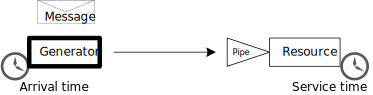

========
Overview
========

SimPype is a simulation framework based on `SimPy <http://simpy.readthedocs.io>`_ that relies on the concepts of resource and pipe.
SimPype decouples the resource from its queue (pipe) in such a way multiple queueing techniques can be used with the same resource.
SimPype also allows to create both custom resource and pipe models that can be reused in multiple simulations.

SimPype supports only Python >= 3.3. Previous versions of Python are not supported.
The quickest way to install SimPype is through `pip3`: 

    >>> pip3 install simpype

SimPype automatically installs SimPy as dependency.

SimPype documentation can be found on `ReadTheDocs <http://simpype.readthedocs.io>`_ while the source code repository is available on `GitHub <https://github.com/Mallets/SimPype>`_.

Concept
=======

A SimPype simulation environment comprises at least one `generator` and one `resource` which are connected via a `pipeline`.
The generator generates `messages` with a given `arrival time`.
Those messages are firs enqueue in the resource `pipe` and next processed by the resources according with a `service time`.

A simple scenario with one generator and one resource can be defined as follows in a python3 console:

    >>> import simpype
    >>> import random
    >>> sim = simpype.Simulation(id = 'overview')
    >>> gen0 = sim.add_generator(id = 'gen0')
    >>> gen0.random['arrival'] = {0: lambda: random.expovariate(1.0)}
    >>> res0 = sim.add_resource(id = 'res0')
    >>> res0.random['service'] = {0: lambda: random.expovariate(1.0)}
    >>> p0 = sim.add_pipeline(gen0, res0)
    >>> sim.run(until = 10)

A scheme of the simulation steps is the following:

